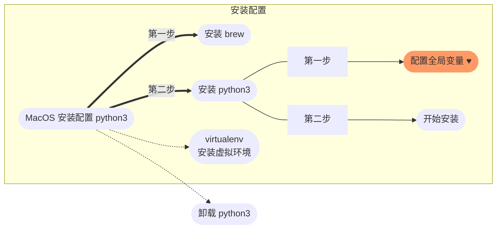

# 前言

## 首先得出结论 brew 安装最优雅

📝 这篇文章记录
- 安装
- 卸载

# 流程图


# brew 安装 python3 步骤
## <a id="brew">安装 brew</a>
建议直接使用魔法安装，或者国内源来安装，不然解决问题好烦。

只需要一行命令：
```
/bin/bash -c "$(curl -fsSL https://raw.githubusercontent.com/Homebrew/install/HEAD/install.sh)"
```

## 安装 python3
### 配置全局变量
在目录 `/Users/$YouMacName` 新建 `.zshrc` 文件
```
echo -e '# brew 安装的 python3 全局环境配置\nexport PATH="/usr/local/opt/python/libexec/bin:$PATH"' >>~/.zshrc
```
网上有很多说要新建 `.bash_profile` 和 `.zshrc` 两个文件，并且在 `.zshrc` 里加载 `.bash_profile`

然后还要使 `source .bash_profile`

经过我的研究，其实这个变量也可以直接加在 `.zshrc` 所以我就简化了

### 开始安装
```
brew install python
```

### 安装检测
```
python -V
```

出现版本号就成功了

###  说明
用 brew 安装的方式会自动安装 pip

我目前用的系统是 macOS monterey 12.6

## 卸载 python3
```
brew uninstall --force python3
```

# python 安装虚拟环境 virtualenv
## 前言
为了防止把系统的 python 环境搞的乱七八糟，还要重装。安装虚拟环境 virtualenv 让 python 环境运行在制定的文件夹内，每一个项目都可以单独隔离，方便调试什么的。
## 具体操作
### 安装 virtualenv
```
pip install virtualenv
```
### 安装检测
```
virtualenv --version
```
## 基本使用
```
# 生成虚拟环境文件夹
virtualenv /$PATH/$my_project
# 激活虚拟环境
source /$PATH/$my_project/bin/activate
# 离开虚拟环境
deactivate
```
### 说明
当前虚拟环境的名字会显示在提示符左侧（比如说 ($my_project)您的电脑:您的工程 用户名$） 以让您知道它是激活的。从现在起，任何您使用 pip 安装的包将会放在 `$my_project` 文件夹中， 与全局安装的 Python 隔绝开。
